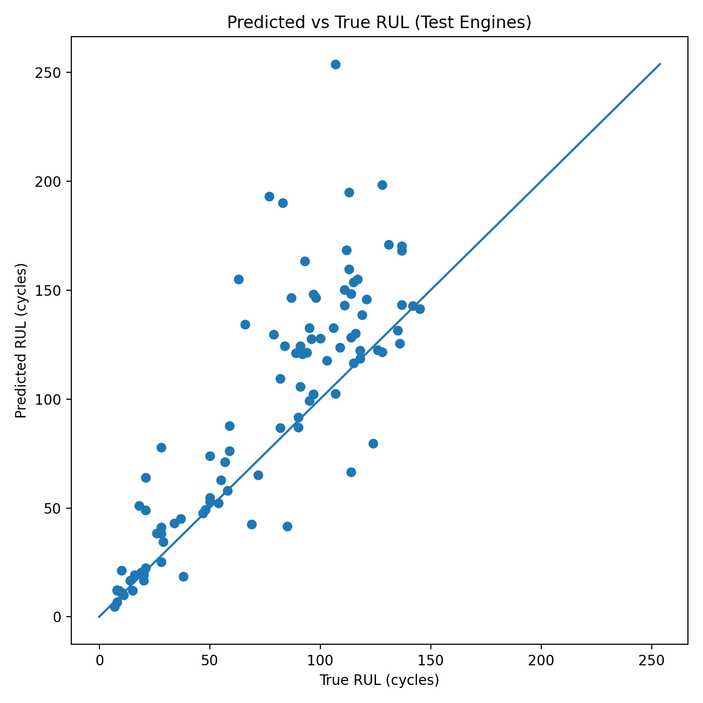
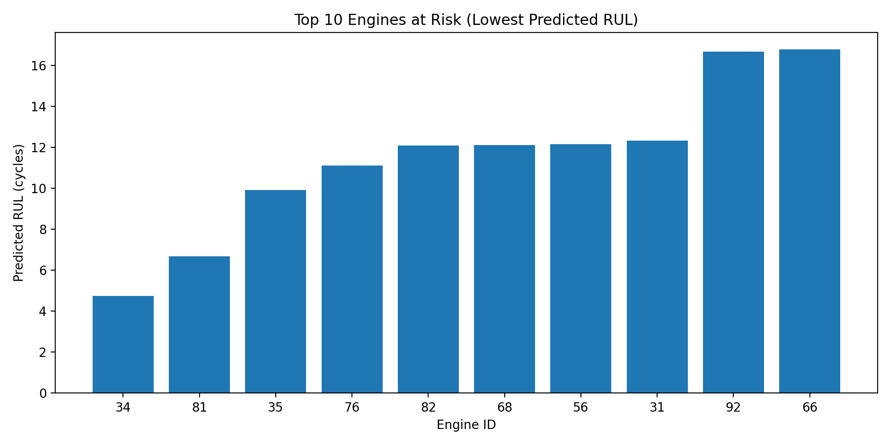
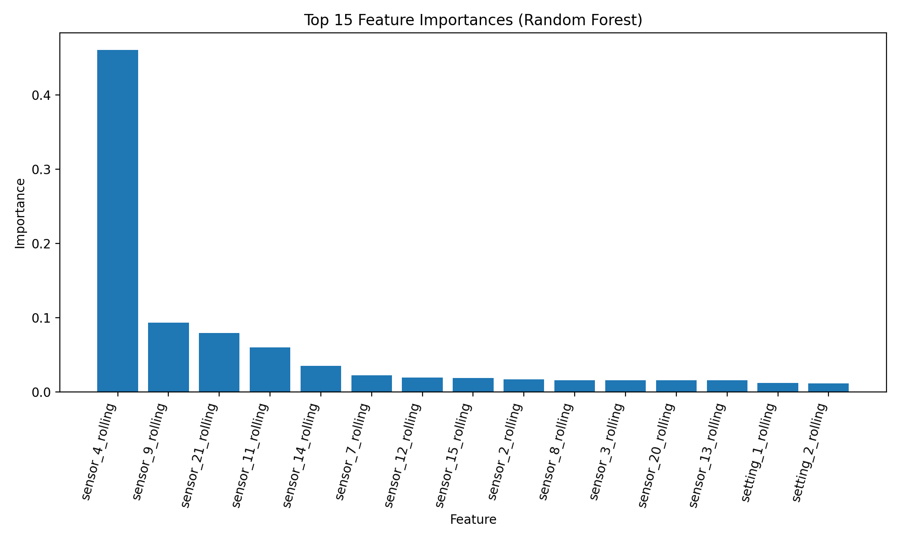

# Turbine Predictive Maintenance using Machine Learning

## Overview

This project implements a predictive maintenance system for turbofan engines using machine learning. The system analyses multivariate sensor data to estimate the **Remaining Useful Life (RUL)** of engines and identify engines at risk of imminent failure.

The goal is to demonstrate how machine learning can support maintenance decision-making in industrial environments by predicting degradation patterns before failures occur.

The project uses the **NASA C-MAPSS Turbofan Engine Degradation Dataset**, a widely used benchmark dataset for predictive maintenance research.

---

## Key Features

- Remaining Useful Life (RUL) prediction using machine learning
- Failure risk classification
- Feature engineering using rolling sensor statistics
- Model evaluation on unseen engines
- Health and risk scoring for operational monitoring
- Visual analytics for model interpretation

---

## Dataset

The project uses the NASA C-MAPSS dataset which simulates turbofan engine degradation over time.

Each engine record contains:

- Engine ID
- Operational cycle
- 3 operational settings
- 21 sensor measurements

Dataset characteristics:

| Property | Value |
|--------|------|
| Engines | 100 |
| Observations | 20,631 |
| Sensors | 21 |
| Operational settings | 3 |

Each engine begins in a healthy state and gradually degrades until failure.

---

## Machine Learning Models

### Remaining Useful Life Prediction

A **Random Forest Regression model** is trained to estimate how many cycles remain before engine failure.

Evaluation metrics:

| Metric | Result |
|------|------|
| MAE | ~23.9 cycles |
| RMSE | ~46 cycles |

Feature engineering reduced prediction error from **~29 cycles to ~24 cycles**.

---

### Failure Risk Classification

A classification model predicts whether an engine is likely to fail soon.

Model performance:

Accuracy ≈ **96%**

---

## Monitoring Metrics

To make model outputs useful for real-world monitoring systems, additional health metrics are calculated.

### HealthScore (0–100)

A normalized health indicator derived from predicted RUL.

```
HealthScore = (Predicted_RUL / Max_RUL_reference) × 100
```

Interpretation:

| Score | Condition |
|------|-----------|
| 80–100 | Healthy |
| 50–80 | Moderate wear |
| 20–50 | Maintenance recommended |
| 0–20 | Critical |

---

### RiskScore (0–1)

A complementary risk indicator:

```
RiskScore = 1 − (HealthScore / 100)
```

Higher values indicate greater failure risk.

---

### RiskLevel

Each engine is categorised for maintenance prioritisation:

| Risk Level | Description |
|-----------|-------------|
| Critical | Failure likely within 30 cycles |
| High | Significant degradation |
| Medium | Moderate wear |
| Low | Healthy operation |

---

## Visual Results

### Predicted vs True Remaining Useful Life



---

### Engines Most At Risk



---

### Sensor Importance



---

## Project Structure

```
siemens-turbine-ml-dashboard
│
├── assets
│   ├── pred_vs_true_rul.png
│   ├── top10_risky_engines.png
│   └── top_feature_importance.png
│
├── data
│   ├── train_FD001.txt
│   ├── test_FD001.txt
│   └── RUL_FD001.txt
│
├── src
│   ├── load_data.py
│   ├── train_model.py
│   ├── train_model_v2.py
│   ├── evaluate_model.py
│   ├── make_charts.py
│   └── add_health_risk_scores.py
│
├── engine_health_snapshot.csv
├── test_engine_summary.csv
└── test_predictions_full.csv
```

---

## Installation

Install dependencies:

```bash
pip install pandas numpy scikit-learn matplotlib
```

---

## Running the Project

Train the improved model:

```bash
python src/train_model_v2.py
```

Evaluate performance on test engines:

```bash
python src/evaluate_model.py
```

Generate charts:

```bash
python src/make_charts.py
```

Generate health monitoring metrics:

```bash
python src/add_health_risk_scores.py
```

---

## Applications

Predictive maintenance systems like this are used in:

- Gas turbines
- Aerospace engines
- Energy infrastructure
- Industrial equipment monitoring

Machine learning models help maintenance teams detect degradation early and prevent unexpected equipment failure.

---

## Author

Jerry Ossai Chukwunedu  
MSc Applied Computer Science  
University of Lincoln