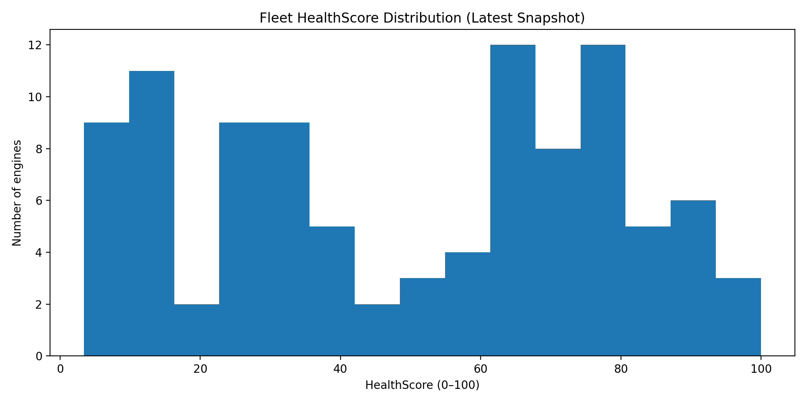

# Turbine Predictive Maintenance using Machine Learning

## Overview

This project implements a predictive maintenance system for turbofan engines using machine learning. The system analyses multivariate sensor telemetry to estimate the **Remaining Useful Life (RUL)** of engines and identify engines at risk of imminent failure.

The goal is to demonstrate how machine learning can support maintenance decision-making in industrial environments by predicting degradation patterns before failures occur.

The project uses the **NASA C-MAPSS Turbofan Engine Degradation Dataset (FD001)**, a widely used benchmark dataset for prognostics and predictive maintenance research.

---

## Quick Start (Dashboard)

Run the interactive monitoring dashboard locally:

```bash
python3 -m streamlit run app.py
```

---

## Key Features

- Remaining Useful Life (RUL) prediction using machine learning
- Failure risk classification (probability + label)
- Feature engineering using rolling sensor statistics
- Official-style evaluation on the NASA test split (FD001)
- Health and risk scoring for operational monitoring (HealthScore, RiskScore, RiskLevel)
- Visual analytics for model interpretation
- Interactive monitoring dashboard with CSV export

---

## Dataset

The project uses the NASA C-MAPSS dataset which simulates turbofan engine degradation over time.

Each engine record contains:

- Engine ID
- Operational cycle
- 3 operational settings
- 21 sensor measurements

Dataset characteristics:

| Property | Value |
|--------|------|
| Engines | 100 |
| Observations | 20,631 |
| Sensors | 21 |
| Operational settings | 3 |

Each engine begins in a healthy state and gradually degrades until failure.

**Files used**
- `data/train_FD001.txt` — training time-series (run-to-failure)
- `data/test_FD001.txt` — test time-series (engines stop before failure)
- `data/RUL_FD001.txt` — true RUL values at the last cycle for each test engine

---

## Machine Learning Models

### Remaining Useful Life Prediction (Regression)

A regression model is trained to estimate how many cycles remain before engine failure.  
Performance is reported using standard regression metrics:

- **MAE** (Mean Absolute Error)
- **RMSE** (Root Mean Squared Error)

Improved model results achieved:

| Metric | Result |
|------|------|
| MAE | ~23.9 cycles |
| RMSE | ~46.2 cycles |

Feature engineering reduced prediction error compared to the baseline (~29 cycles MAE).

---

### Failure Risk Classification

A classification model predicts whether an engine is likely to fail soon (binary risk flag with probability).  
This enables prioritisation of maintenance actions beyond the raw RUL number.

Typical results achieved:

- Accuracy ≈ **96%**

---

## Monitoring Metrics

To make model outputs useful for real-world monitoring, additional health metrics are calculated.

### HealthScore (0–100)

A normalized health indicator derived from predicted RUL:

```
HealthScore = (Predicted_RUL / Max_RUL_reference) × 100
```

Interpretation:

| Score | Condition |
|------|-----------|
| 80–100 | Healthy |
| 50–80 | Moderate wear |
| 20–50 | Maintenance recommended |
| 0–20 | Critical |

---

### RiskScore (0–1)

A complementary risk indicator:

```
RiskScore = 1 − (HealthScore / 100)
```

Higher values indicate greater failure risk.

---

### RiskLevel

Engines are categorised for maintenance prioritisation:

| Risk Level | Description |
|-----------|-------------|
| Critical | Very low predicted remaining life |
| High | Significant degradation detected |
| Medium | Moderate wear |
| Low | Healthy operation |

---

## Visual Results

### Predicted vs True Remaining Useful Life


---

### Engines Most At Risk


---

### Sensor Importance


---

### Fleet Health Distribution



---

## Interactive Monitoring Dashboard (Streamlit)

The project includes a **Streamlit-based monitoring dashboard** that provides a simple interface for:

- Fleet health overview (KPIs)
- Risk ranking of engines
- Engine-level drill-down with time-series plots
- Maintenance recommendation logic (threshold-based)
- CSV export (fleet snapshot + selected engine time-series)

Run locally:

```bash
python3 -m streamlit run app.py
```

---

## Outputs Produced

The pipeline generates CSV outputs that can be imported into BI tools or used for reporting:

- `engine_health_snapshot.csv` — latest monitoring snapshot per engine (risk + health)
- `test_engine_summary.csv` — last-cycle summary per engine in the test set
- `test_predictions_full.csv` — full time-series predictions across test engines
- `dashboard_data.csv` — dashboard-ready dataset (if generated)

---

## Project Structure

```
siemens-turbine-ml-dashboard
│
├── assets
│   ├── fleet_health_distribution.png
│   ├── pred_vs_true_rul.png
│   ├── top_feature_importance.png
│   └── top10_risky_engines.png
│
├── data
│   ├── RUL_FD001.txt
│   ├── test_FD001.txt
│   └── train_FD001.txt
│
├── src
│   ├── add_health_risk_scores.py
│   ├── evaluate_model.py
│   ├── load_data.py
│   ├── make_charts.py
│   ├── plot_health.py
│   ├── train_model.py
│   └── train_model_v2.py
│
├── app.py
├── dashboard_data.csv
├── engine_health_snapshot.csv
├── README.md
├── test_engine_summary.csv
└── test_predictions_full.csv
```

---

## Installation

Install dependencies:

```bash
python3 -m pip install pandas numpy scikit-learn matplotlib streamlit
```

---

## Running the Project

Train the improved model:

```bash
python3 src/train_model_v2.py
```

Evaluate performance on test engines (NASA test split):

```bash
python3 src/evaluate_model.py
```

Generate charts:

```bash
python3 src/make_charts.py
```

Generate health monitoring metrics:

```bash
python3 src/add_health_risk_scores.py
```

Run the monitoring dashboard:

```bash
python3 -m streamlit run app.py
```

---

## Applications

Predictive maintenance systems like this are used in:

- Gas turbines
- Aerospace engines
- Energy infrastructure
- Industrial equipment monitoring

Machine learning models help maintenance teams detect degradation early, prioritise maintenance actions, and reduce unexpected equipment failure.

---

## Author

**Jerry Ossai Chukwunedu**  
